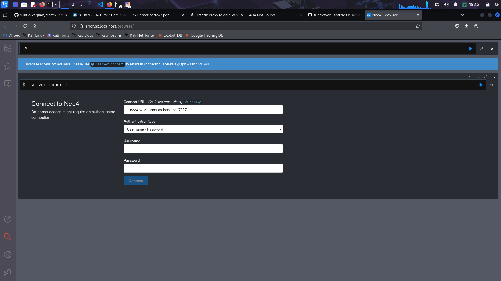

# PARCIAL 2 - SISTEMAS DISTRIBUIDOS

## PUNTO 1

Entregables:

### Configuración inicial de Traefik con al menos tres rutas personalizadas con nombres de Pokémon.

- charizard.localhost para traefik

- Diagrama simple (papel/foto) que muestre qué servicio corresponde a cada Pokémon.
  

## PUNTO 2

capturas mostrando balanceo en comerciales

logs en legendarios.

## PUNTO 3

Configuración de al menos dos middlewares aplicados a servicios distintos.

Configuramos un midleware `Basic-Auth` en el servicio de neo4j y uno de `ratelimit` en nuestro servicio backend

- Documento breve (3–4 líneas) explicando la analogía de cada middleware.

  - **Basic-Auth**: La autenticacion basica es para comprobar que la persona quien intenta acceder es realmente a quien queremos darle la informacion. En el aeropuerto, un pasajero solo puede hacer chek-in una vez que el oficial del aeropuerto verifique que tu seas quien realmente ha comprado el ticket mediante la informacion del pasaporte

  - **Rate-Limit**: El rate limit es para restringir las peticiones de nuestros clientes a nuestros servicios en un periodo determinado. En el aeropuerto, generalmente tienes que hacer una fila para que quien verifica tu pasaporte ya que solo es una persona, esta se sobrecargaria si tuviera que verificar muchos pasaportes al mismo tiempo

- pruebas mostrando:

  - que sin credenciales no se accede a Neo4j
    

    con Credenciales:
    

  - el filtro de la API está activo.
    

## PUNTO 4

Servicio interno restringido (ej. Neo4j admin) sin exposición pública pero
accesible desde la red interna.

intentamos acceder a neo4j desde `http://snorlax.localhost/`

Servicio público adicional (ej. Nginx) con un mensaje de bienvenida.

Llamamos a `http://hello.localhost/` donde tenemos la siguiente salida:

### REFLEXION

Nuestro aeropuerto pokemon refleja transparencia debido a que llegamos a nuestros vuelos mediante llamados a rutas establecidas sin que el usuario sepa que pasa detras de cortinas, se puede escalar debido a que podemos replicar un mismo servicio para concurrencia como verificar pasaportes, si contratamos mas personas que lo hagan.
