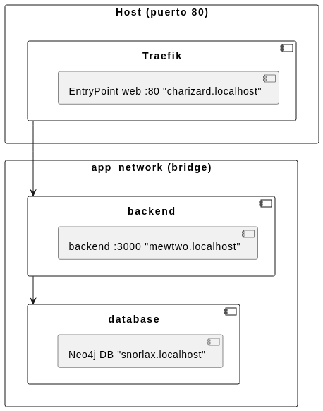

# PARCIAL 2 - SISTEMAS DISTRIBUIDOS

## PUNTO 1

Entregables:

### Configuración inicial de Traefik con al menos tres rutas personalizadas con nombres de Pokémon.

- charizard.localhost para traefik

- Diagrama simple (papel/foto) que muestre qué servicio corresponde a cada Pokémon.
  

## PUNTO 2

capturas mostrando balanceo en comerciales

logs en legendarios.

